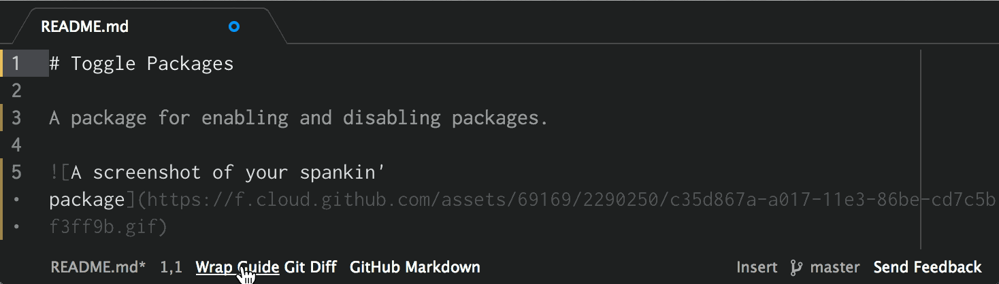
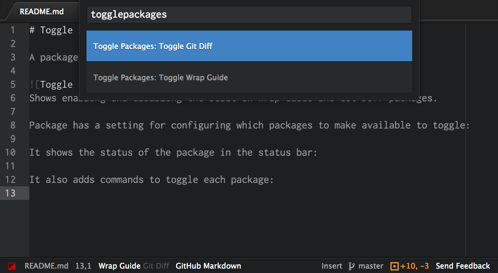
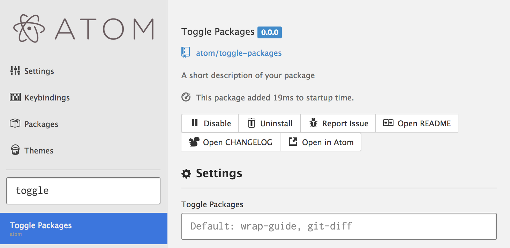

# Toggle Packages 

A package for enabling and disabling packages.

*Enabling and disabling the built-in "Wrap Guide" and "Git Diff" packages.*

It displays the status of packages in the status bar. Disabled packages are dimmed. Clicking a package name toggles it.

It also creates commands for toggling packages.

A setting controls which packages to enable toggling for.

